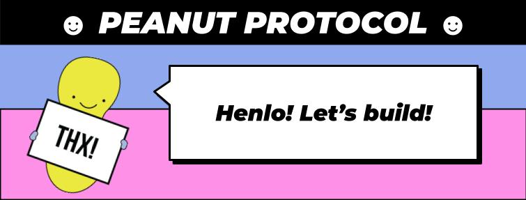

[Now Hiring!](https://peanutprotocol.notion.site/TS-Fullstack-Nut-93f621339f744c9b8054a8140d2c06ea?pvs=74)
# Welcome to ☺ Peanut Protocol ☺

[Now Hiring!](https://peanutprotocol.notion.site/TS-Fullstack-Nut-93f621339f744c9b8054a8140d2c06ea?pvs=74)

## Making Token Transfers 100% nuts

Peanut is a protocol to transfer tokens using URLs. Peanut Protocol uses secret-protected vault smart contracts. The sender deposits tokens to the vault and sends the URL to the receiver. The URL contains a secret, allowing the receiver to withdraw the funds. 

## Our Repos
- [Smart Contracts Repository](https://github.com/peanutprotocol/peanut-contracts)
- [SDK Repository](https://github.com/peanutprotocol/peanut-sdk)
- [API Repository](https://github.com/peanutprotocol/peanut-api)
- [UI Repository](https://github.com/peanutprotocol/peanut-ui)

## How It Works
It's super easy:
1. **Deposit**: Senders deposit tokens into a secret-protected vault contract.
2. **Share**: A unique URL containing a secret is generated.
3. **Withdraw**: The receiver uses the URL to withdraw the tokens from the vault.

Don't deal with wallet addresses and chain preferences, just send a link. You can send crypto tokens or NFTs through a URL like this:
`https://peanut.to/claim?c=matic&i=14&v=v3&p=8rDKrwSpC7TACqrl`
With Peanut, that's all it takes to move digital assets securely.

## How You Can Contribute
We thrive on community contributions and are open to pull requests. We welcome any code and non-code contributions. Here's how you can contribute:

### For Coders:
- Check out our repositories, pick an issue labeled 'help wanted' or 'good first issue', and start coding!
- Adhere to the coding standards and guidelines provided in our [CONTRIBUTING.md](profile/CONTRIBUTING.md)
- Write clear, commented code and ensure it comes with tests.

### For Non-Coders:
- Participate in discussions to suggest features or improvements.
- Help with comarketing and bd efforts.
- Update documentation for clarity or completeness (get in touch on Discord https://discord.gg/kVZqXDkrq7 )
- Engage with us on social media and spread the word about Peanut Protocol.

# Retroactive funding
We're now experimenting with retroactiv funding for contributions. We've never done it properly before but we've had a few feature bounties and a few bug bounties. We'd love to be even more open.

## Contributing to Peanut
We believe in collaboration and open-source. If you're interested in contributing to the Peanut Protocol, check out our [Contribution Guidelines](CONTRIBUTING.md).
